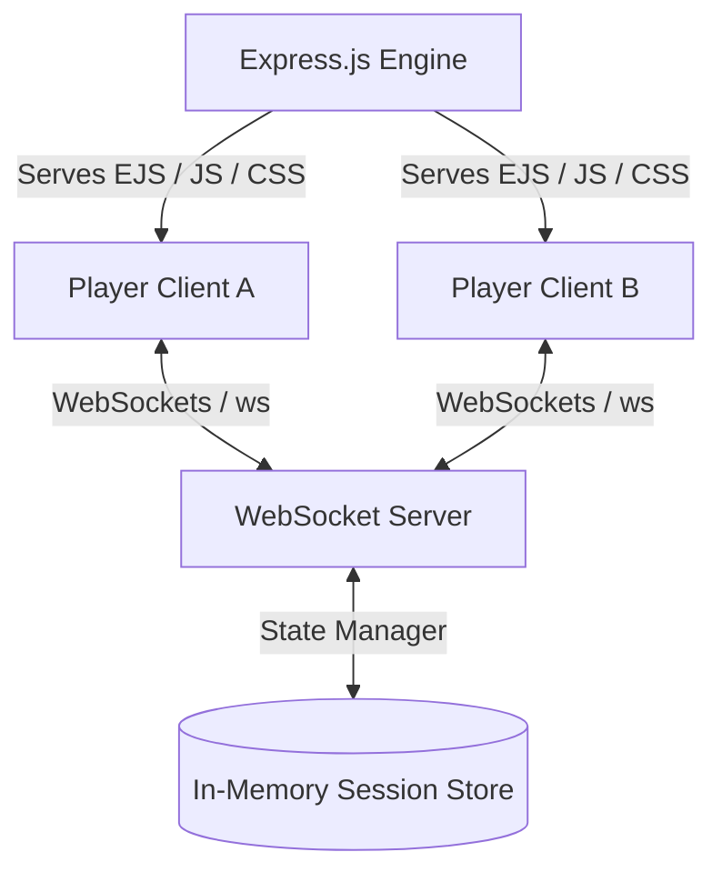

# Scribbl - Real-Time Multiplayer Drawing System

A scalable real-time multiplayer drawing and guessing game inspired by Skribbl.io, built with a focus on distributed system design, low-latency communication, and event-driven architecture.

---

## Live Demo
**[Scribbl Live Game Link](https://scribbl-2nmw.onrender.com/)**

---

## System Overview

Scribbl is designed as a **real-time distributed system** where multiple clients interact simultaneously through WebSockets. The backend architecture is optimized for low-latency event propagation, stateless scaling, and server-authoritative game state validation.



---

## Architecture & Principles

Key architectural guidelines implemented:
- **Event-Driven Communication:** Bidirectional synchronization using lightweight WebSocket messages.
- **Stateful Isolation:** Separated in-memory session blocks keyed by secure room tokens.
- **Robust Layering:** Complete modular separation between game state calculation (`gameLogic.js`), route handling (`indexRoutes.js`), WebSocket handshakes (`socketHandler.js`), and frontend rendering engines (`canvas.js`, `socket.js`, `ui.js`).
- **Responsive Layout:** Dynamic viewport scaling accommodating mobile touch inputs as smoothly as desktop click-and-drag.

---

## Tech Stack

- **Backend:** Node.js, Express.js (MVC Pattern with EJS Template Engine)
- **Real-Time Layer:** WebSockets (`ws` library)
- **Frontend:** HTML5 Canvas, Vanilla HSL CSS variables, Javascript

---

## Key Features

### 1. Public Matchmaking (Quick Play)
- **Play Random Mode:** Join an active game instantly via the central landing page.
- **Dynamic Lobby Search:** Automatically detects active public rooms with space (up to a limit of 8 concurrent players) or instantiates a fresh public room if none have open slots.
- **Ownerless Lifecycle Management:** Public rooms run an autonomous multiplayer logic. The game countdown and rounds trigger automatically once at least **2 players** enter the lobby, preventing inactive owners from stalling the lobby.

### 2. Private Room Control
- **Custom Game Settings:** Fully configurable game parameters, including:
  - Total number of game rounds.
  - Draw time (seconds per turn).
  - Word selection count.
  - Custom words injection (comma-separated).
- **Owner Authority:** Strict permissions ensure only the designated Room Owner can save settings and initialize the game.
- **Seamless Ownership Transfer:** If the owner disconnects, the system automatically assigns the next active player as the new room owner, enabling settings controls dynamically.

### 3. Advanced Drawing Toolkit
- **Interactive Palette:** Premium Skribbl-style dual-column color grid featuring a selection of preset shades.
- **High-Fidelity Brush Settings:** Continuous brush size adjustment via selectors (Small, Medium, Large, Giant) with active dot visual preview widgets.
- **Tool Options:**
  - **Pencil/Brush:** Fluid brush stroke engine.
  - **Fill Shape (Flood Fill):** Optimized flood-fill algorithm for color-filling closed areas on the canvas instantly.
  - **Undo Canvas Action:** Quick rollback of the last drawn stroke.
  - **Clear Canvas:** Wipes the canvas clean.
- **Authority Guards:** Restricts canvas interaction strictly to the current active drawer, ignoring unauthorized stroke inputs.

### 4. Game Logic & Scoring Engine
- **Turn-Based Rotation:** Automatically sequences players through drawer and guesser states.
- **Multi-Factor Score Calculation:** Dynamic score rewards computed based on quickness of solve (solve timestamp relative to turn elapsed time) and a bonus multiplier for the drawer when guessers solve correctly.
- **Timer Shrinkage:** Speeds up round timers automatically once a player correctly guesses the target word to keep the gameplay fast-paced.

---

## Getting Started

### Local Setup
Ensure you have [Node.js](https://nodejs.org/) installed, then follow these steps:

1. Clone the repository and navigate into the workspace:
   ```bash
   git clone https://github.com/pankaj8128/scribbl.git
   cd scribbl
   ```
2. Install dependencies:
   ```bash
   npm install
   ```
3. Run the development server:
   ```bash
   npm start
   ```
   *The server runs locally at: `http://localhost:3000`*

### Running with Docker
To containerize and run the application locally or in a production stack:

1. Build the optimized Docker image:
   ```bash
   docker build -t scribbl .
   ```
2. Start the container mapping port `3000`:
   ```bash
   docker run -p 3000:3000 scribbl
   ```

---

## Reliability & Integrity

- **Server-Authoritative Validation:** Prevents rogue client scripts from submitting unauthorized canvas updates or guessing out of turn.
- **Clean Disconnect Rollbacks:** If players disconnect mid-round, the game adjusts scoring pools, checks win-conditions, and advances turns automatically.

---

## Author

**Pankaj Jagadale**
- GitHub: [@pankaj8128](https://github.com/pankaj8128)
- LinkedIn: [Pankaj Jagadale](https://linkedin.com/in/pankaj8128)
